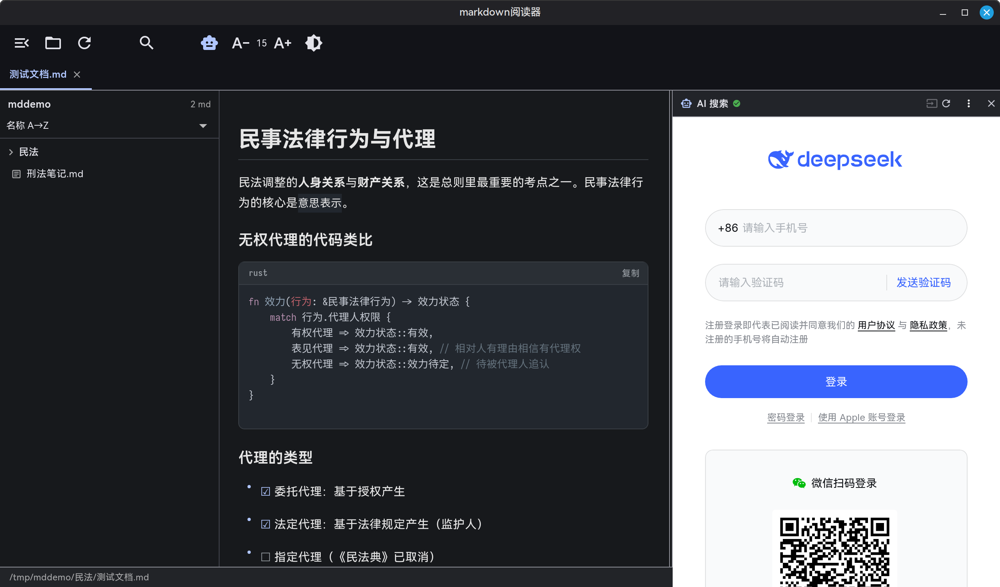
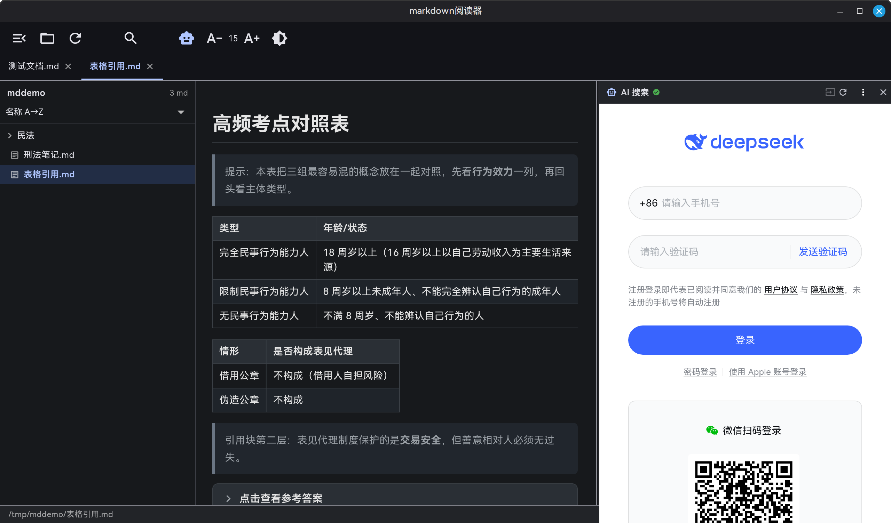

# 优化报告（v0.2.4 → v0.3.0）

日期：2026-09-29 · 验证环境：Linux Mint / X11 / 4K 3840×2160（scale=2）/ Flutter 3.x

本次围绕你提的三个问题做修复，并顺手落地了一批产品改进。**全部 85 个 Dart 测试、31 个 Rust 测试通过，Linux release 构建成功，并在本机 4K 屏上做了真机截图验证。**

---

## 一、三个问题的诊断与修复

### 问题 2（最严重）：AI 问答打开永远停在「正在调整宽度…」

**根因：HiDPI 坐标系错误，网页被推出了窗口可见区。**

- 现象里有个关键细节：头部是**绿色对勾**——说明网页其实**加载成功了**，只是看不见。
- Linux 端网页不是 Flutter widget，而是原生层把一块 WebKitGTK 视图按 Dart 下发的矩形
  「盖」在窗口上（`GtkOverlay` 叠加子件，用 margin + size-request 定位）。
- 旧代码 Dart 侧把矩形**乘了 `devicePixelRatio`** 当「设备像素」下发；但 GTK3 的
  `gtk_widget_set_margin_start` / `gtk_widget_set_size_request` 用的是**应用像素（逻辑坐标）**，
  缩放因子由 GDK 在窗口层自己处理——Flutter 视图的布局坐标和它们是同一单位，根本不需要乘。
- scale=1 的显示器上恰好不出错，所以开发时没暴露；**你的主屏是 4K（157–161 DPI，
  GNOME auto → scale=2）**，矩形被放大 2 倍：分栏在窗口右侧，x 翻倍后整个网页被推出
  窗口右边界（被 GtkOverlay 裁掉）→ 永远只剩占位文案「正在调整宽度…」。

**修复（已在本机 4K 屏真机验证，DeepSeek 登录页正常显示）：**

1. 坐标契约改为**逻辑像素**，Dart 不再乘 `devicePixelRatio`，两侧注释同步更正；
2. 顺手修掉同模块三个时序/状态问题：
   - `_syncNative()` 的可见性判定值 `want` 原来在 `await open()` **之前**计算，
     open 期间就绪事件到达时，旧值会把刚就绪的网页再藏起来 → 改为 await 之后现算；
   - 原生 `open` 应答新增 `pageReady` 字段：重开面板时网页早已加载完、不会再有加载事件，
     旧代码头部状态会永远停在「加载中」→ Dart 凭 `pageReady` 直接置就绪态；
   - 原生 `open` 不再无条件 `SetPaneVisible(true)`：首次加载期间保持隐藏，
     让「正在打开…」占位可见（原本会闪一块空白网页），显隐完全交给 Dart 驱动。

> 相关测试：`test/ai_pane_test.dart` 新增 pageReady 应答、loadUrl 两例，旧协议用例同步更新。

### 问题 1：Markdown 渲染区分度不高

旧样式确实「平」：标题六级只有 1.62/1.38/1.18/1.06/1.0/1.0 倍字号、无分隔线，
h4 以下和加粗正文几乎一样；段落间距 4px；引用只有一条 3px 左边线；正文列宽上限
1180px（一行 ~78 个汉字，远超舒适区）。

**改版内容（纯 Flutter 层，不动 Rust 协议）：**

| 元素 | 改动 |
|---|---|
| 标题 | 字号阶梯拉开到 **1.86/1.5/1.26/1.12/1.0/0.92**；h1/h2 加底部细分隔线；h6 弱化色 |
| 引用块 | **底色 + 4px 左边条 + 弱化文字色**，三层信号，一眼可辨 |
| 代码块 | 新增**头部栏**（语言标签 + 一键复制，复制后变 ✓已复制）；**长行横向滚动**不再换行搅烂缩进 |
| 表格 | 表头加深加粗 + **斑马纹**（隔行底色，行多了不串行） |
| 列表 | 序号/项目符号用主题强调色小面积点缀，结构感增强 |
| 任务列表 | ☑ 强调色加粗 / ☐ 灰色，完成状态扫一眼就分出 |
| 图片 | 圆角 + 细边框；alt 非空时附一行说明文字 |
| 正文 | 列宽上限 1180 → **880px**（中文舒适阅读宽度），段落间距 4→6px |

效果见文末截图。

### 问题 3：换文件夹后没有历史记录

诊断：**历史其实一直在存**（`session.json` 里 `recentRoots` 有 3 条），但唯一入口在
「欢迎页」——而欢迎页只有在「一个标签都没有」时才出现。标签一开，历史就等于不存在。

**修复（两层）：**

1. **入口前移**：工具栏「打开文件夹」改为下拉菜单——「打开文件夹…」+ 最近打开的
 10 个文件夹（当前项打勾、不存在的目录置灰），一键切换；
2. **按文件夹记忆工作区**（更进一步）：每个文件夹各自的**标签组 + 活动标签**都记进会话
 （`session.workspaces`），切走自动保存、切回原样恢复——和 VS Code 的 per-folder
 工作区一个体验。滚动位置本来就按 `文件夹|文件` 记，无需改动。

> 相关测试：`test/workspace_test.dart`（真实 .so + 临时目录）验证「切换 → 记住 → 切回 →
> 恢复活动标签」全链路 + 最近列表去重置顶。

---

## 二、落地的产品改进

| 功能 | 说明 |
|---|---|
| **`Ctrl+P` 快速打开** | 模糊匹配当前文件夹全部文档：多个空格分隔的词必须全部命中（`民法 代理` 能直接筛出 `16-民法·民事法律行为与代理.md`），文件名优先；↑↓ 选择、Enter 打开。工具栏也有 ⚡ 按钮 |
| **大纲（TOC）面板** | 侧栏第三种形态（与搜索互斥），按标题层级缩进列出当前文档全部标题，点击按比例近似定位跳转（多轮收敛，和滚动恢复同一套手法）。工具栏列表图标开关 |
| **标签交互** | 中键点击直接关闭（浏览器肌肉记忆）、`Ctrl+W` 关当前标签、悬停显示完整路径 |
| **AI 面板站点切换** | ⋮ 菜单里可在 DeepSeek / Kimi / 豆包 / ChatGPT 之间切换，记忆选择；「带入提问框」用的是通用 textarea/contenteditable 选择器，主流站点都能填 |

## 三、顺带发现并修掉的两个隐患

1. **测试会覆盖真实 `session.json`**：会话保存有 800ms 防抖，`ai_pane_test` 里
   `AppState.askAi()` 触发保存后，会把几乎空白的会话写进真实的
   `~/.config/com.chensdong.mdreader/session.json`（你的最近打开列表就是这样被清掉的，
   已从快照恢复）。现在新增 `NativeCore.configDirOverride` 测试入口，相关测试全部指向
   临时目录，并验证测试前后 session.json 不再变动。
2. **`SessionData` 默认构造的 map 不可变**：`filePositions = const {}` 在工作区写入时直接
   抛 `Unsupported operation`（`rememberScroll` 也有同样隐患）→ 构造时一律改为可变的空 map。

## 四、验证结果

- `dart analyze`：**0 error**；
- `flutter test`：**85 全过**（新增 8 例：工作区 ×2、会话新字段 ×2、大纲 ×2、快速打开 ×1、Ctrl+P/W ×3 等，另更新 AI 协议与标题比例断言）；
- `cargo test`：**31 全过**（Rust 未改动）；
- `flutter build linux --release`：成功；**4K(scale=2) 真机截图验证**：AI 面板正常显示
  DeepSeek 登录页、渲染改版效果、大纲面板、表格斑马纹、引用块样式均符合预期。

### 渲染改版 + AI 面板修复后（深色）

### 表格斑马纹 / 引用块 / 折叠块

### 大纲面板（侧栏）

---

## 五、建议的下一步（本次未做，按价值排序）

1. **打开大文档偏慢**（496/774ms）：瓶颈在 JSON 序列化 + 跨边界拷贝，可换紧凑数组编码或
   二进制协议（预估省 40~60%），或分批下发块；
2. **公式 / Mermaid 接真实渲染器**：接入点已留好（`_pushTextWithMath` / `_MermaidFallback`）；
3. **主题预设**（纸张米白 / 护眼绿）：配色已集中在 `MdStyle.of`，加预设成本低；
4. **图片点击放大查看器**、**搜索历史**、**快捷键帮助浮层（`Ctrl+/`）**；
5. **目录自动监听刷新**（Rust `notify`，原版 Tauri 有）；
6. 标签条溢出菜单（「关闭其他 / 复制路径」）。

> 说明：`docs/images/` 里的三张验证截图已入库；`session.json` 已恢复你的原始数据
> （最近打开 3 条、滚动位置、AI 面板状态）。版本号已升至 **0.3.0+6**。
